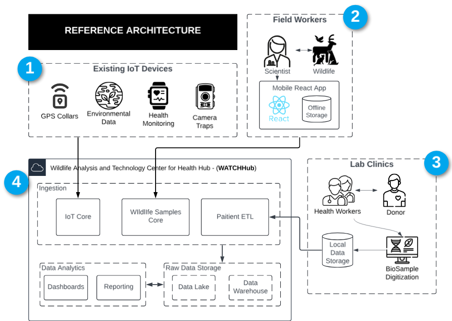

## 🚨 Portfolio Scenario: Responding to a Wildlife-Origin Virus Outbreak

This project is a **portfolio simulation**, designed to showcase how I would architect and implement a scalable, secure, AWS cloud-native solution in response to a **wildlife-origin virus outbreak** with potential human spillover.

It demonstrates my experience in:

- Creating clear architectural documentation and artifacts to communicate with dev teams, analysts, and leadership
- Understanding and modeling business cases (e.g., opt-in human health data coordination)
- Selecting appropriate AWS services to fit the business requirements
- AWS solution design, development of CDK architecture and coding skills
- Integrating existing IoT devices to AWS ingestion and analytics pipelines.
- Applying security best practices with AWS services (IAM, Secrets Manager, IoT Core certificates, fine-grained access policies)
- Structuring infrastructure as reusable, maintainable code across multiple stacks

Everything in this project is fictional but grounded in real-world architecture patterns used in health, government, and research cloud systems.

# Scenario: Wildlife Health Surveillance Cloud Solution (WATCH)

**Wildlife Health Surveillance (WHS) Program**, is a fictional program dedicated to monitoring and detecting pathogens affecting wildlife populations, which can potentially spill over to humans, posing a significant public health risk. To facilitate this work, the WHS Program requires a robust and scalable IT solution for the genomic analysis of wildlife samples, storage of genomic sequence data, and sharing of results with various stakeholders, including wildlife health organizations, research institutions, and public health agencies.

There are 

## 📐 Reference Architecture and Overview

<p align="center">
  
</p>

This reference architecture presents a real-world context in which multiple independent entities are already collecting valuable data related to wildlife and public health. The primary focus of this project is to build the **WATCHHub** — a centralized ingestion and coordination platform that enables secure, scalable, and unified access to data streams across all these sources.

<details>
<summary>1️⃣ Existing IoT Devices</summary>

- IoT sensors such as GPS collars, environmental monitors, health trackers, and camera traps are already deployed in the field and maintained by third-party contractors. These devices transmit telemetry data via satellite and are available for integration with centralized infrastructure.
</details>

<details>
<summary>2️⃣ Existing Field Scientists & Mobile Data Collection</summary>

- Field workers actively collect wildlife samples during on-site research. A **React-based mobile application**, equipped with offline storage, allows them to digitize metadata and field observations, which are later synced to the cloud.
</details>

<details>
<summary>3️⃣ WATCHHub (Project Focus)</summary>

- The core focus of this project is to build the **Wildlife Analysis and Technology Center for Health Hub (WATCHHub)** — a cloud-native ingestion platform that centralizes data from all external sources. WATCHHub standardizes data, enforces security and compliance, and provides shared access for stakeholders such as researchers, public health officials, and partner organizations. It is designed to support workshops and collaboration across technical and non-technical teams.
</details>

<details>
<summary>4️⃣ Existing Lab Clinics & Human Health Data</summary>

- Lab clinics operating near potential outbreak zones collect opt-in health data from donors. These clinics already manage biosample digitization and local data storage but require secure onboarding into a unified system for integrated analysis alongside wildlife data.
</details>

## 🧪 Simulation setup, design, AWS Services and implementation

This is a simulation project. The IoT devices, field stations, and lab clinics described do not exist physically. As part of this GitHub deployment, a simulated architecture has been implemented to replicate the data flow and behavior of a real-world wildlife surveillance system. The sections below outline how each component is emulated within the cloud environment.

## IoT Device Simulation Architecture ##

<p align="center">
  
</p>

In the real world, IoT devices would transmit telemetry data via satellite to a centralized platform. This simulation replicates that process using the following AWS services and components:

- **Amazon ECR**: Hosts container images for each simulated IoT device (e.g., GPS collars, environmental sensors), each containing a Python script.
- **Amazon ECS**: Orchestrates the deployment of containers by defining task configurations for each device type.
- **AWS Fargate**: Runs the ECS tasks as serverless containers, allowing each simulated device to execute independently without managing infrastructure.
- **JSON Payloads**: Python scripts inside each container generate structured JSON telemetry data that mimics real-world IoT device output.
- **MQTT Protocol**: Simulated telemetry is streamed using the MQTT protocol, replicating how real devices transmit data over low-bandwidth networks.
- **AWS IoT Core (Downstream Hub)**: Acts as the simulated cloud ingestion point where data would be routed in a production setting for processing, storage, and analysis.

---

## 🧪 Key Use Cases Identified from Architecture

<details>
  <summary>1️⃣ IoT-Based Wildlife Data Collection</summary>
  
  - **GPS Collars** on animals collect movement and geolocation data.
  - **Environmental Data Sensors** track climate, pollution, and habitat conditions.
  - **Health Monitoring Devices** collect biological and physiological data from wildlife.
  - **Camera Traps** capture visual data on wildlife presence and behaviors.
</details>

<details>
  <summary>2️⃣ Edge-to-Cloud Data Ingestion & Processing</summary>
  
  - **ECS IoT Cluster Containers** handle incoming sensor data streams.
  - **IoT Rules Engine** routes messages from IoT devices to AWS Lambda functions.
  - **Lambda Functions** process real-time sensor data (`GPSTopicProcessor.py`, `EnvTopicProcessor.py`, etc.).
  - **Raw data is categorized into separate processing layers** for GPS, environmental, health, and camera data.
</details>

<details>
  <summary>3️⃣ ETL Pipelines for Data Transformation & Storage</summary>
  
  - **Data is extracted, cleaned, and transformed** through specialized ETL functions (`GPS_ETL`, `Env_ETL`, `Hea_ETL`, etc.).
  - **Processed data is stored in Amazon S3** (acts as a structured data lake for analysis).
  - **ETL pipelines** enable structured storage of wildlife movement, health metrics, and environmental conditions.
</details>

<details>
  <summary>4️⃣ Integration with Off-Site Health Clinics & Research Labs</summary>
  
  - **Secure Direct Connect & On-Prem PostgreSQL Server** for data sharing.
  - **Clinic Staff & Researchers** access wildlife data to study potential pathogen spillover into human populations.
  - **On-premise clinic software & IoT health monitoring data exchange** ensure collaboration with public health organizations.
</details>

<details>
  <summary>5️⃣ Data Analytics & Visualization</summary>
  
  - **Metabase (BI Tool) provides dashboards and queries** for analyzing wildlife data.
  - **Analysts can query GPS movement trends, environmental changes, and wildlife health risks.**
  - **Historical & real-time insights support decision-making** for conservationists and epidemiologists.
</details>


---

## ⚙️ AWS Architecture (via CDK)

## ⚙️ AWS Architecture (via CDK)

This solution is split across modular stacks:

| Stack | Purpose |
|-------|---------|
| `EcrStack` | Manages ECR repositories for IoT containers |
| `EcsStack` | Deploys ECS Fargate services for IoT telemetry publishing |
| `IotCodeStack` | Automates IoT Thing creation, policy assignment, cert management |
| `DataIngestionStack` | Handles ingestion pipelines |
| `DataAnalyticsStack` | Sets up AWS Glue jobs, Athena queries, and S3 data storage |
| `AuthStack` | Implements AWS Cognito authentication for secure access |
| `AmplifyStack` | Deploys a front-end UI using AWS Amplify |
| `ClinicIngestionStack` | Manages integration with PostgreSQL for clinic-related data ingestion |
| `FileGatewayStack` | Facilitates file uploads and secure storage on S3 |

---

## 🔐 Security Features

- **AWS Secrets Manager** for secure credential storage
- **IAM Roles & Policies** enforcing fine-grained access control
- **AWS Cognito** for authentication & identity management
- **Encrypted Data Pipelines** with S3 & RDS security best practices
- **AWS Direct Connect** for secure, high-speed clinic data exchange

---

## 📦 Tech Stack

### **☁️ Main AWS Services Used**
- **Compute:** ECS Fargate, Lambda
- **Storage:** S3, RDS (PostgreSQL), AWS Storage Gateway
- **IoT & Data Streaming:** AWS IoT Core, Kinesis, SNS
- **Security & IAM:** Cognito, Secrets Manager, IAM Policies
- **Data Processing:** AWS Glue, Athena, Step Functions, DynamoDB
- **Front-End & API Gateway:** AWS Amplify, API Gateway
- **Monitoring & Logging:** CloudWatch, CloudTrail, Metabase
---

## 📁 Repo Structure

```bash
├── lib/
│   ├── iot/
│   │   ├── ecr-stack.ts
│   │   ├── ecs-stack.ts
│   │   ├── iot-stack.ts
│   │   └── helpers/
│   │       ├── ecs-factory.ts
│   │       └── iot-factory.ts
│   └── platform/
│       ├── data-ingestion-stack.ts
│       ├── data-analytics-stack.ts
│       ├── auth-stack.ts
│       └── amplify-stack.ts
├── bin/
│   └── cdk.ts
├── README.md
└── cdk.json
```

---

## 🚀 Deployment

1. Install dependencies:
   ```bash
   npm install
   ```

2. Bootstrap the CDK environment:
   ```bash
   cdk bootstrap
   ```

3. Deploy:
   ```bash
   cdk deploy --all
   ```

---

## 🧰 Admin Roles

- **Cloud Architect & Lead:** Oversees design and deployment
- **Data Management Lead:** Manages genomic data pipelines and compliance

---

## 📎 Resources

- [📘 Design Doc (PDF)](link-to-pdf)
- [📖 Blog: Deploying IoT Genomics with AWS CDK](your-blog-link)
- [📊 Live Demo (if applicable)](link)

---

## 📜 License

MIT
